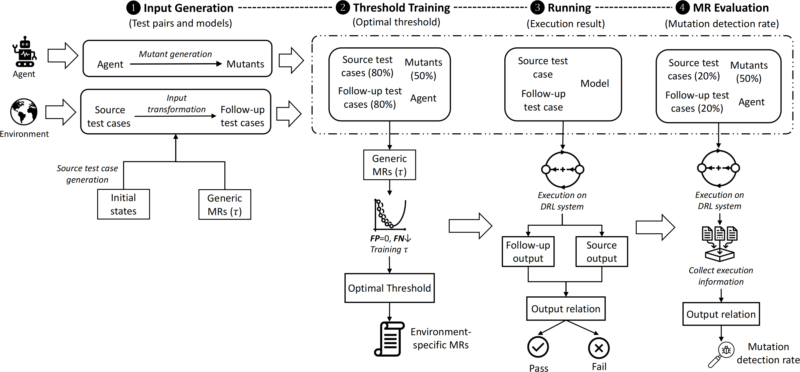

# MDPMorph


## 📢 News
- [2025.07]: Our tool paper has been accepted at **ASE 2025**
  - 🚩Title: *Metamorphic Testing of Deep Reinforcement Learning Agents with MDPMORPH*
  - 👨‍💻Authors: Jiapeng Li, Zheng Zheng, Yuning Xing, Daixu Ren, Steven Cho, Valerio Terragni

- [2025.07]: Our paper has been accepted at **ISSRE 2025**
  - 🚩Title: *MDPMORPH: An MDP-Based Metamorphic Testing Framework for Deep Reinforcement Learning Agents*
  - 👨‍💻Authors: Jiapeng Li, Zheng Zheng, Yuning Xing, Daixu Ren, Steven Cho, Valerio Terragni


## 📘 Introduction

MDPMorph is a novel metamorphic testing framework specifically designed for deep reinforcement learning (DRL) agents.

MDPMorph takes environment and DRL agent as input, samples initial states from the environment to generate metamorphic test pairs, and prodeuces mutants based on predefined mutation rules for testinng purposes. In the **Running** mode, potential faults in the agent are uncovered by comparing the execution outputs of automatically generated metamorphic test pairs to verify whether the output relation of the MR is satisfied. The **Threshold Training** mode is used to optimize MR thresholds by analyzing the execution results of the original agent and its mutants. The **MR Evaluation** mode calculates the mutant detection rate to evaluate MR effectiveness. 




## 🎥 Demo Video

Watch the demo video to better understand how to use MDPMorph.

[](https://youtu.be/IwMaUfQ2xnQ)


## 🚀 Getting Started

#### Step 1: Clone the repository

```git clone``` the repository into your desired directory on your local machine.

#### Step 2: Install dependencies:

```bash
pip install -r requirements.txt
```

#### Step 3: Preparing test suites

You can use your own test suites or generate test cases automatically.

⚙️ Option 1: Use your own test suites
If you already have test suites, you can put your source test suites into the ```./Metamorphic/test_suite```.

> ⚠️ **Note:** Ensure that each line in the test suite file represents a complete test case (an initial state array), with each element in the test case separated by a space.

⚙️ Option 2: Auto-generate source test suites
You can automatically generate source test suites by running:

```bash
python generate_tests.py \
-- num_suites 50 \
-- num_cases 100
```

* ```--num_suites``` The number of test suites.
* ```--num_cases``` The number of test cases in each test suite.

Select the specific test suites you want to use for testing from the generated ones, and place them in the ```./Metamorphic/test_suite``` directory.


#### Step 4: Preparing test models
You can use your own trained model or generate mutated models automatically.

⚙️ Option 1: Use your own model
If you already have a trained model, place the model file in the following folder: ```./gymnasium_envrionments/scripts/model```.

> ⚠️ **Note:** Make sure the model format matches the environment and agent architecture expected by MDPMorph.

⚙️ Option 2: Auto-generate mutated models
MDPMorph provides several scripts to generate different types of mutated models from a baseline agent. Run one of the following Python scripts depending on the mutation type:

```bash
# Example: Generate fuzzy weight mutants
python Gaussian_Fuzzing_operator.py
-- num_mutants 20

# Example: Generate layer addition mutants
python Layer_Addition_operator.py
-- num_mutants 20
```

* ```--num_mutants``` The number of mutants.

Select the models you want to validate from the generated mutants, and place them in the ```./gymnasium_envrionments/scripts/model``` directory.


#### Step 5 (Optional): Adding a new relation

MDPMorph provides several predefined metamorphic relations, including the optimal thresholds.
You can also design your own and apply it as needed. The following points should be noted when applying new relation:

1. Place your relation as a Python file in ```./gymnasium_envrionments/scripts/train_loops```.
2. Your file should include the essential functions required for system operation, such as ```env.reset()```, ```env.step()```, ```agent.select_action```, and others.
3. During the validation phase, your relation must be deterministic.


#### Step 6: Running testing command

```bash
python run.py evaluate\
--data_path model/TD3-BipedalWalker-v3-25_03_21_17-40-18 \
--relation_path train_loops/policy_loop_MR2_Test.py \
```

* ```--data_path``` The path for loading the model under test.
* ```--relation_path``` The path for loading the metamorphic relation.


#### Step 7: Observing the results

During the validation process, the execution results will be saved in ```./Metamorphic/test_outcome```.It includes the violation rate and the corresponding number of inputs. The "violation rate" refers to the proportion of test cases in a test suite that violate the expected properties defined by the metamorphic relations. The "number of inputs" refers to the total number of test cases in the test suite.

The results of each tested model are saved in a separate CSV files for further analysis.


```bash
### Output example

| Violation rate | Input |
|----------------|-------|
| 0.88           | 100   |
| 0.93           | 100   |
| 0.86           | 100   |
| ...            | ...   |
| ...            | ...   |
```


## 🎯 Threshold Training

We use the stochasitc gradient descent method to obtain the optimal thresholds in predifned relations of MDPMorph.

#### Step 1: Preparing test suites


Select some test suites from ```./Metamorphic/test_suite``` to be used for threshoold training.

> ⚠️ **Note:** These test suites should be different from those used in the validation phase.


#### Step 2: Preparing test models

Select mutants from ```./gymnasium_envrionments/scripts/model``` for threshold training.

> ⚠️ **Note:** These types of mutants should be different from those used in the validation phase.


#### Step 3: Running threshold training command

```bash
python run_threshold_training.py evaluate\
--data_path model/TD3-BipedalWalker-v3-25_03_21_17-39-53 \
--relation_path train_loops/policy_loop_MR2.py \
```

* ```--data_path``` The path for loading the original agent (well-trained model) and the mutants.
* ```--relation_path``` The path for loading the threshold training program.

We use original agent to train threshold that ensure the false positive rate of 0, while also examining how these thresholds affect mutant detection.

#### Step 4: Observe and record threshold evolution

During the threshold training process, we save the threshold values at two levels for detailed observation:

1. **Test case level:** After each test case is executed, we record the updated threshold value in ```./Metamorphic/training_threshold```. This allows us to analyze how individual cases influence the threshold adjustment. 
2. **Test suite level:** After completing the execution of each full test suite, we additionally save the threshold value in ```./Metamorphic/training_threshold```. This provides a summary of the overall effect of the test suite on the threshold.

These results are saved in sparate CSV files for further analysis. Once the threshold value converge, meaning it become stable across many evaluations, you can take the final value as the optimized threshold for that MR.


## ❤️ Acknowledgments

This project is based on [cares_reinforcement_learning](https://github.com/UoA-CARES/cares_reinforcement_learning). Thanks for their awesome works. We sincerely acknowledge and appreciate the reinforcement learning efforts contributed by [CARES](https://cares.blogs.auckland.ac.nz/).

## 📬 Contact
 
If you have any questions, please feel free to contact: ```jp_li@buaa.edu.cn```.

## 🎓 Citations

If our code helps your research or work, please consider citing our paper. The following are BibTeX references:
```bash
@inproceedings{li2025mdpmorph,
  title={MDPMORPH: An MDP-Based Metamorphic Testing Framework for Deep Reinforcement Learning Agents},
  author={Li, Jiapeng and Zheng, Zheng and Xing, Yuning and Ren, Daixu and Cho, Steven and Terragni, Valerio},
  booktitle={2025 IEEE 36th International Symposium on Software Reliability Engineering (ISSRE)},
  year={2025},
  organization={IEEE}
}
```

